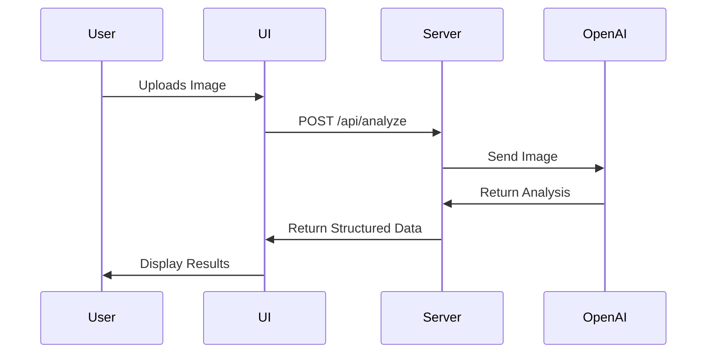

# Food Identifier App - Architecture

## Project Overview
A web application that allows users to upload food images and receive AI-generated ingredient identification using OpenAI's GPT-4o API.

## Tech Stack
- **Framework**: Remix
- **UI Library**: Shadcn UI with Tailwind CSS
- **API Integration**: OpenAI API (GPT-4o)
- **TypeScript**: For type safety

## Coding Practices
- **Functional Programming**: Prefer pure functions and immutability
- **Plugin Registry**: For extensible feature management
- **Decorators**: For cross-cutting concerns
- **Service Architecture**: For business logic separation

## Project Structure
```
app/
├── components/       # UI components
│   ├── ui/           # shadcn/ui components 
│   └── custom/       # App-specific components
├── lib/              # Utility functions
├── models/           # Type definitions
├── routes/           # Remix routes
├── services/         # Business logic services
│   └── openai/       # OpenAI API integration
└── styles/           # Global styles
```

## Flow Diagrams

### Image Upload and Analysis Flow


## Development Approach
Following an 80/20 rule:
- 80% focus on clean, maintainable code
- 20% focus on speed to market

## API Integration
OpenAI GPT-4o API will be used to analyze food images and identify ingredients. 